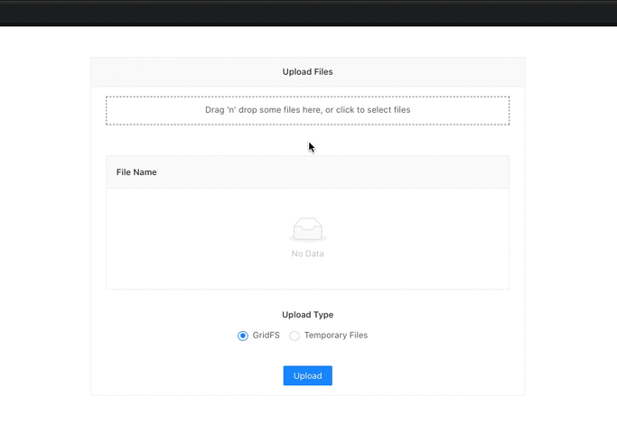

<center>

  <h3>reactjs-agilite-file-upload-demos</h3>
  <p>A Demo ReactJS App that shows how to upload 1 or more files to Agilit-e's File Managers via Node-RED Flows</p>
</center>

***
### Requirements

In order to use this project, you need to have an [Agilit-e](https://agilite.io) Account and an instance of [Node-RED](https://nodered.org/) running.
***

### 📦 Installation

Once you've cloned this project run the following command:

```node
npm install
```

***

### 🔨 Configuration

The project contains a "contents" folder, where you can find the [Node-RED Flows](contents/node-red-flow.json) and the [Agilit-e Connector Profile](contents/agilite-connector-profile.json) for MongoDB GridFS. 


<br />
<br />

The Node-RED flows contain HTTP Request nodes that are consumed by the ReactJS App. These flows prep the submitted files and upload them to Agilit-e either permanently using the GridFS connector, or temporarily to Agilit-e's temp file store.


The *Node-Red Flows* can be imported into your existing Node-RED environment and the Connector Profile can be imported into your team via the [Agilit-e Admin Portal](https://portal.agilite.io).

The *.env* file contains a URL for the GridFS upload and a URL for the temporary file upload, both these URLs should point to your Node-RED environment. Below is an example of what the *.env* file contains.

```node
REACT_APP_GRIDFS_UPLOAD_URL="http://localhost:6011/api/uploadFileGridFS"
REACT_APP_TEMP_FILES_UPLOAD_URL="http://localhost:6011/api/uploadFileTemp"
```

*Note: The Node-RED flows contain [Agilit-e Connector nodes](https://www.npmjs.com/package/node-red-contrib-agilite) which need to be installed. You will need to configure an Agilit-e Server, providing the URL to Agilit-e's API Server and a generated API-Key (The key is generated in the Agilit-e Admin Portal). The server is configured by double-clicking the Agilit-e Connectors node, clicking on the pencil icon next to the "Server" field and then providing the Agilit-e API Server URL and API Key.*

<center>
  
</center>

***
### 💻 Usage

Run the following command:
```
npm start
```
The App will be launched in a browser window.

- Drag one or more files onto the Dropzone area.
- Specify the Upload Type. (GridFS for Permanent file storage or Temporary file upload)
- Click on the upload button

<center>
  
</center>